

# PA4 Submission: TaskFlow Pipeline

Copy this file to <code style="color:#111827;background:#ddd6fe;padding:2px 4px;border-radius:4px;">SUBMISSION.md</code>. Put every screenshot in <code style="color:#111827;background:#ddd6fe;padding:2px 4px;border-radius:4px;">docs/</code>, embed it under the correct task, and write a short description below each image explaining what it proves. The grader should not need any file outside this repository.

## Student Information

| Field | Value |
|---|---|
| Name | Muhammad Talha Yaseen |
| Roll Number | 23030025 |
| GitHub Repository URL | https://github.com/OyeeeTalha/CS487-PA4 |
| Resource Group | `rg-sp26-23030025` |
| Assigned Region | `uaenorth` |

## Evidence Rules

- Use relative image paths, for example: ``.
- Every image must have a 1-3 sentence description below it.
- Azure Portal screenshots must show the resource name and enough page context to identify the service.
- CLI screenshots must show the command and output.
- Mask secrets such as function keys, ACR passwords, and storage connection strings.

## Task 1: App Service Web App (15 points)

### Evidence 1.1: Forked Repository

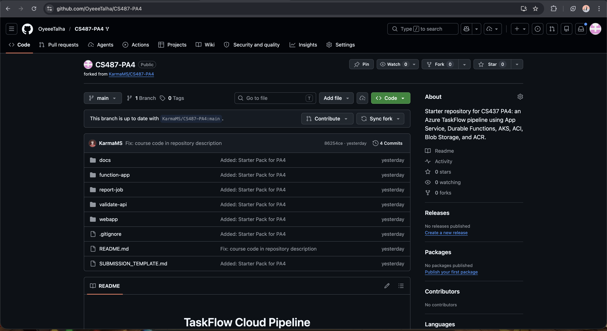

Description: This is my personal fork of the CS487-PA4 starter repository under my GitHub account (OyeeeTalha). The fork contains the full PA4 structure including the webapp, function-app, validate-api, and report-job directories, and all my changes are pushed here rather than to the original repo.

### Evidence 1.2: App Service Overview

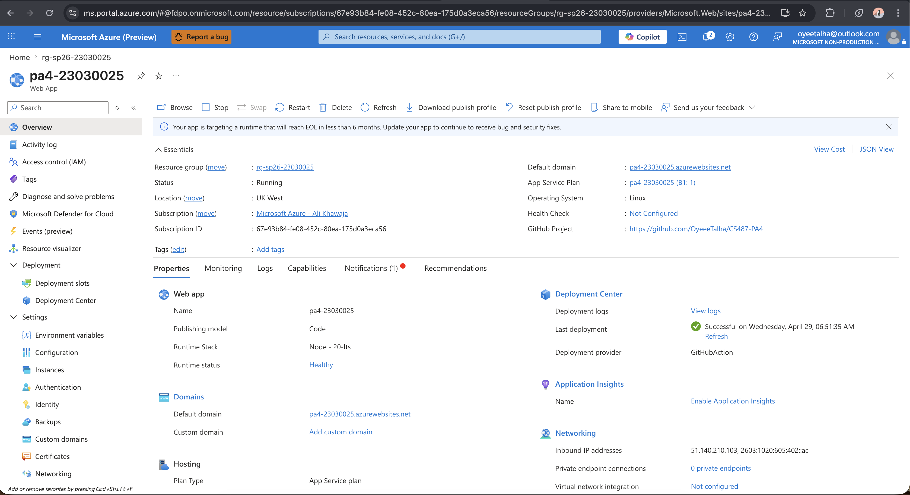

Description: This shows the App Service named pa4-23030025 in resource group rg-sp26-23030025, deployed to the UAE North region with the Node 20 LTS runtime stack. The status shows Running and the public URL is https://pa4-23030025.azurewebsites.net.

### Evidence 1.3: Deployment Center / GitHub Actions

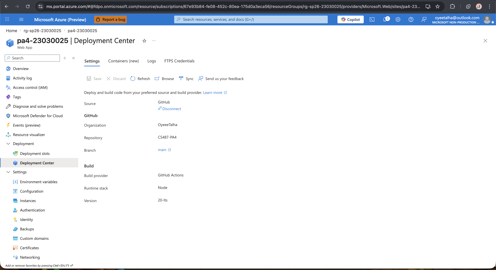

Description: The Deployment Center shows the Web App is connected to my GitHub fork (OyeeeTalha/CS487-PA4) on the main branch. A GitHub Actions workflow was auto-generated and the most recent deployment completed successfully, meaning any push to main automatically redeploys the app.

### Evidence 1.4: Live Web UI

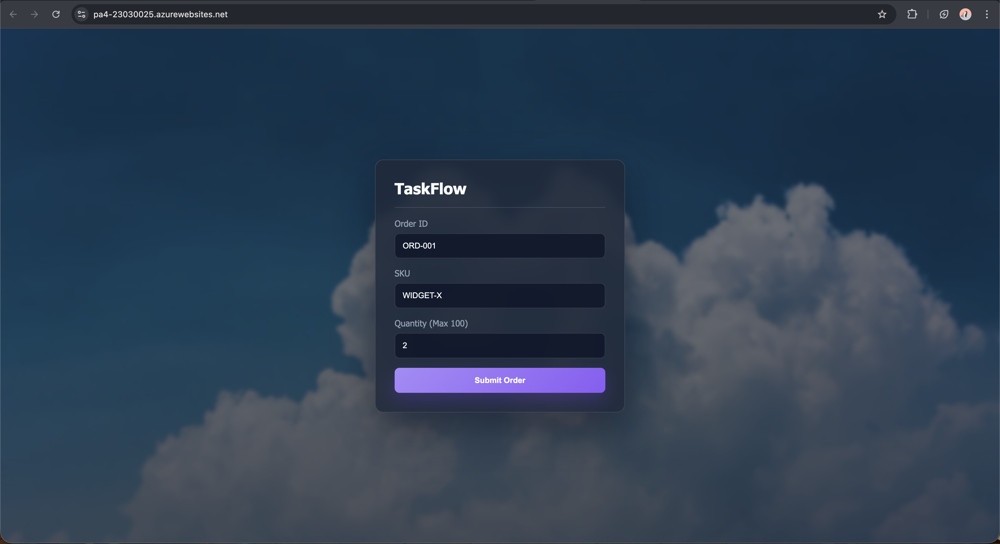

Description: The App Service is successfully serving the TaskFlow frontend over HTTPS. The page loads the order submission form and the status panel, which confirms the Node.js Express app is running correctly on Azure.

---

## Task 2: Azure Container Registry (15 points)

### Evidence 2.1: ACR Overview

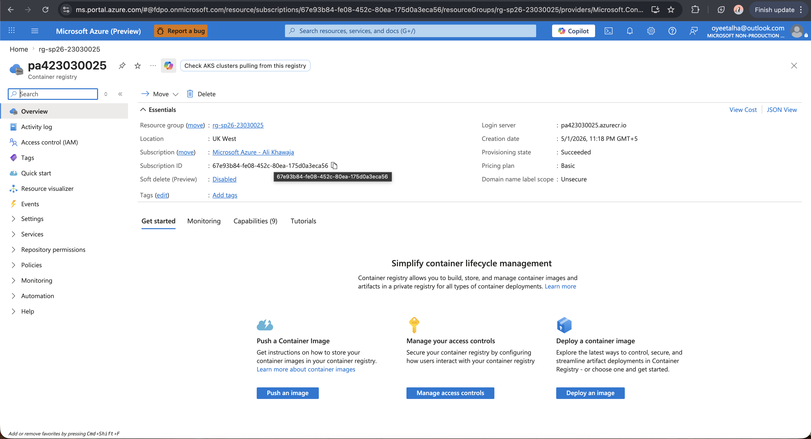

Description: This is the Azure Container Registry named pa4pa423030025 under resource group rg-sp26-23030025, deployed to UAE North with the Basic SKU. The Admin user is enabled, which is required so AKS and the Function App can pull images using username/password credentials.

### Evidence 2.2: Docker Builds

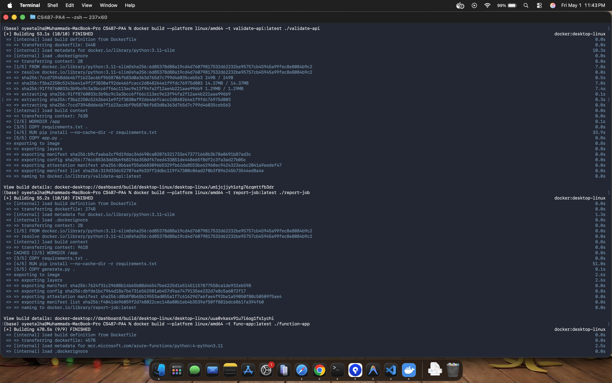

Description: Three separate Docker builds are shown here, one for each service directory: validate-api produces the FastAPI validator image, report-job produces the one-shot report generator image, and function-app produces the Durable Function container image. All three were built with the linux/amd64 platform flag to ensure compatibility with Azure.

### Evidence 2.3: ACR Repositories

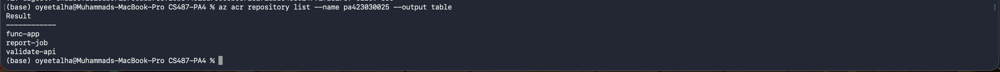

Description: The ACR repository list confirms that all three images were pushed successfully: validate-api:v1, report-job:v1, and func-app:v1. These are the images consumed by AKS (Task 5), ACI (Task 6), and the Function App (Task 4) respectively.

---

## Task 3: Durable Function Implementation (12 points)

### Evidence 3.1: Completed Function Code

[function_app.py](function-app/function_app.py).

Description: The orchestrator first calls validate_activity, which POSTs the order payload to the AKS validator endpoint read from the VALIDATE_URL environment variable. If the response comes back with valid set to false, the orchestrator returns a rejected status immediately and stops. If the order is valid, it then calls report_activity, which uses the Azure SDK to create a Container Instance running the report-job image, polls until the container reaches the Succeeded state, and returns the blob URL of the generated PDF.

### Evidence 3.2: Local Function Handler Listing

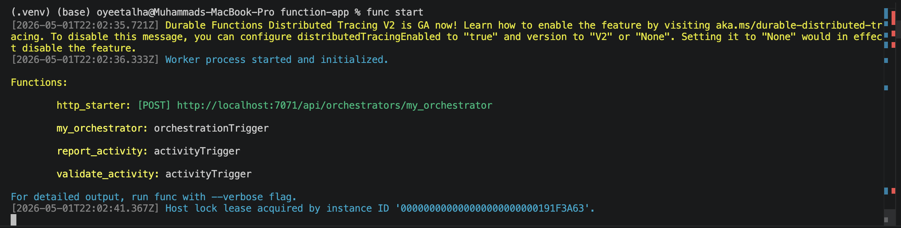

Description: The func start output shows all four Durable Function handlers were discovered and registered by the Azure Functions runtime: http_starter, my_orchestrator, validate_activity, and report_activity. This confirms the function_app.py is syntactically correct and the decorators are wired up properly.

---

## Task 4: Function App Container Deployment (8 points)

### Evidence 4.1: Function App Container Configuration

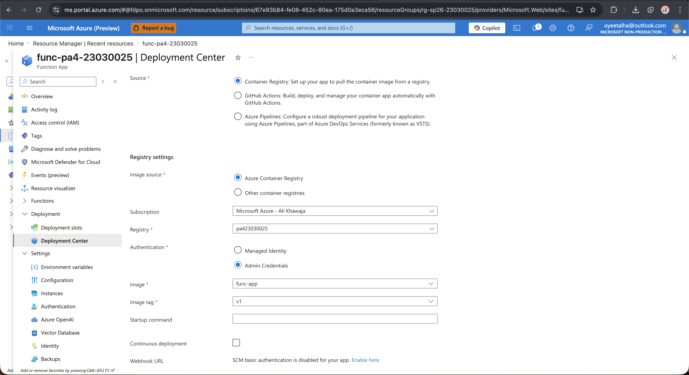

Description: The Function App named pa4-23030025 is configured to pull its container image from pa4pa423030025.azurecr.io/func-app:v1. The deployment method is set to Container Image, and the App Service Plan pa4-23030025 (B1) is reused from Task 1 to avoid extra cost.

### Evidence 4.2: Orchestration Smoke Test

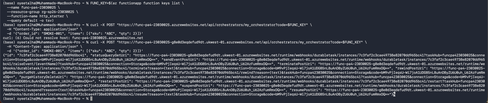

Description: The curl response includes an id field and a statusQueryGetUri, which proves the HTTP starter received the request and successfully kicked off a new orchestration instance. The fact that these management URLs were returned means the Function App container is running and the Durable runtime is functioning correctly.

### Evidence 4.3: Expected Failed Status Before Downstream Wiring

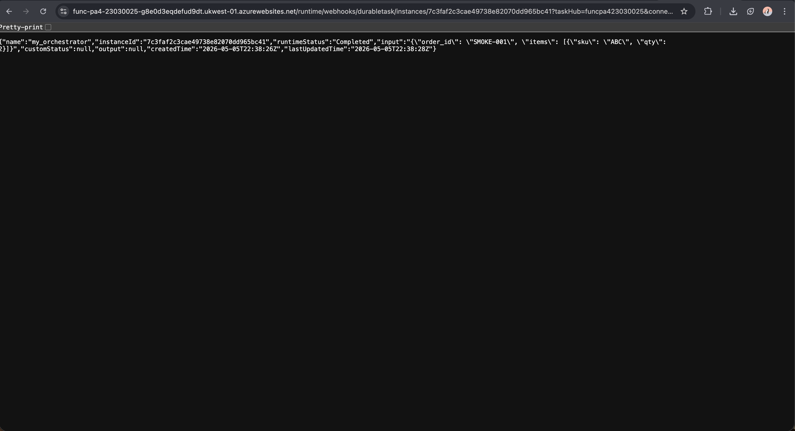

Description: Polling the statusQueryGetUri shows runtimeStatus as Failed with an error about being unable to reach VALIDATE_URL. This is expected at this stage because the AKS validator has not been deployed yet and the environment variable is not set. It proves the orchestrator ran, checkpointed, attempted the validate_activity call, and failed gracefully at the right place.

---

## Task 5: AKS Validator (15 points)

### Evidence 5.1: AKS Cluster

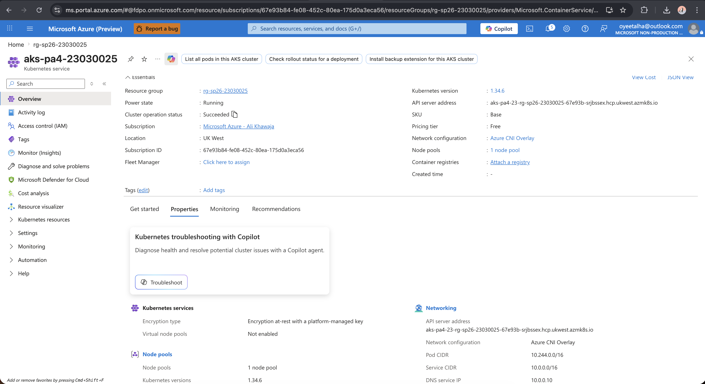

Description: The AKS cluster named pa4-23030025 is running in resource group rg-sp26-23030025 in UAE North. It has a single node pool with 1 node of size Standard_B2s, which is the smallest size that keeps costs reasonable for this assignment.

### Evidence 5.2: Kubernetes Nodes and Pods

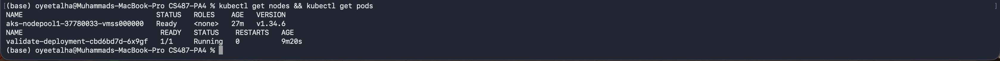

Description: kubectl get nodes shows the single B2s node in Ready status, and kubectl get pods shows the validator pod is in the Running state. This confirms the deployment.yaml was applied successfully and the container was pulled from ACR without any credential issues.

### Evidence 5.3: Kubernetes Service

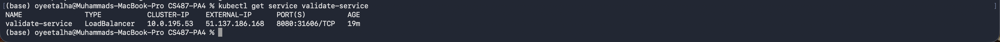

Description: The validate-service of type LoadBalancer has been assigned a public external IP on port 8080. Azure provisioned this IP automatically when the service.yaml was applied, and it is the URL used to reach the validator from the Durable Function.

### Evidence 5.4: Validator API Tests

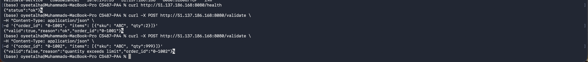

Description: The health check returns a 200 OK. A valid order with qty 2 returns {"valid": true, "reason": "ok"}, while an order with qty 999 returns {"valid": false, "reason": "quantity exceeds limit"}. This confirms the validator correctly accepts normal orders and rejects any with quantity above 100.

### Evidence 5.5: Function App `VALIDATE_URL`

Description: The VALIDATE_URL application setting on the Function App is set to http://<external-ip>:8080/validate, pointing directly at the AKS LoadBalancer service. The validate_activity reads this environment variable at runtime to know where to send order payloads for validation.

### Evidence 5.6: AKS Idle Behavior

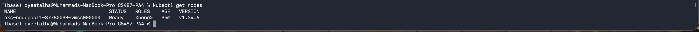

Description: Even when no orders are being submitted, the AKS node and the validator pod remain in a Running state. Unlike ACI, AKS does not stop or scale to zero on its own with this configuration, meaning the node continues to incur compute cost while idle. This is acceptable here because the validator is a long-lived service that needs to be immediately available when each order arrives.

---

## Task 6: ACI Report Job (15 points)

### Evidence 6.1: Blob Container

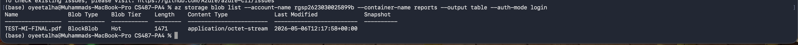

Description: The reports blob container was created inside the storage account pa4pa423030025. This is where the report-job container writes the generated PDF after each successful order, and the Function App reads the expected URL from this path to return to the caller.

### Evidence 6.2: Manual ACI Run

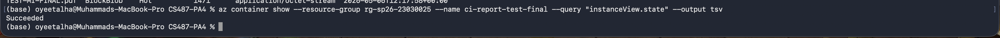

Description: The az container show output shows the container group ci-report-test reached the Succeeded state. The report-job container is designed to do its work and exit cleanly, so Succeeded here means it ran to completion without errors and the restart policy of Never ensures it did not restart after finishing.

### Evidence 6.3: ACI Logs

Description: The container logs show the report job reading the order payload from environment variables, generating the PDF in memory, and uploading it to the reports blob container. The final log line confirms a successful upload, which is the signal the Durable Function waits for before returning the blob URL.

### Evidence 6.4: Generated PDF

Description: The az storage blob list output shows TEST-001.pdf listed inside the reports container, with a matching creation timestamp. This proves the ACI container actually wrote its output to blob storage rather than just exiting silently.

### Evidence 6.5: Function App Managed Identity and IAM

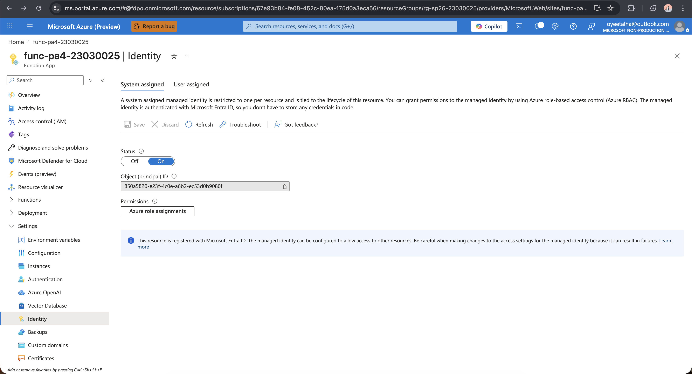

Description: The user-assigned managed identity mi-pa4-23030025 is attached to the Function App under the Identity blade. The report_activity uses DefaultAzureCredential, which picks up this identity automatically, so the Function App can call the Azure Container Instance API to create and delete containers without storing any secret credentials in code or app settings.

### Evidence 6.6: Report App Settings

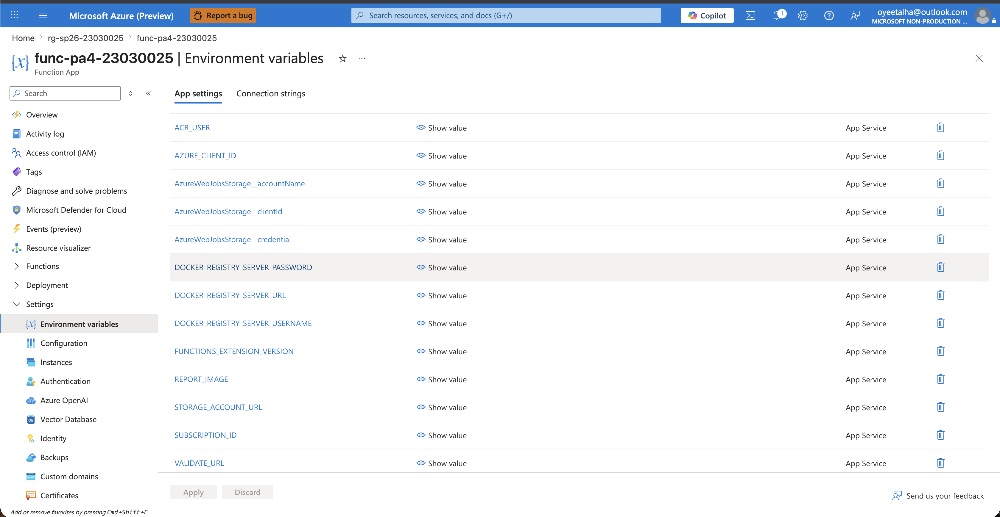

Description: The REPORT_IMAGE setting tells the Function App which ACR image to use when spawning the report ACI. ACR_SERVER, ACR_USERNAME, and ACR_PASSWORD (masked here) allow the ACI to pull that image from the private registry. STORAGE_ACCOUNT_URL tells the report container where to upload the PDF, REPORT_RG and REPORT_LOCATION tell the SDK which resource group and region to create the ACI in, and AZURE_CLIENT_ID ties the managed identity to the container so it can authenticate to storage without a connection string.

---

## Task 7: End-to-End Pipeline (15 points)

### Evidence 7.1: Web App Wiring

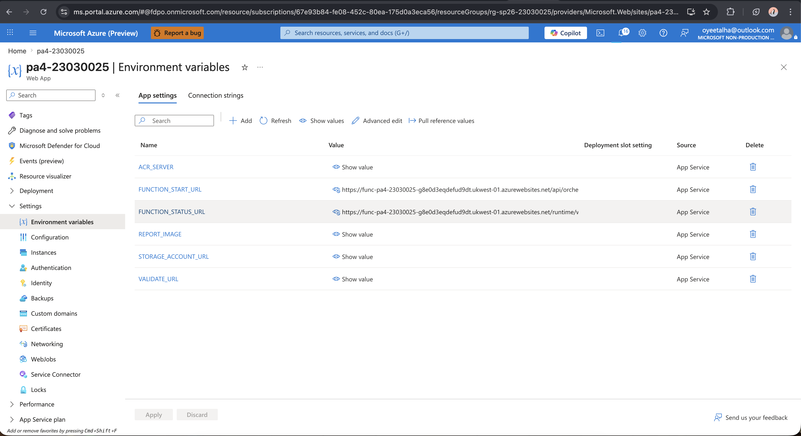

Description: FUNCTION_START_URL is set to the HTTP starter endpoint with the function key appended, and FUNCTION_STATUS_URL is set to the Durable Task webhook base URL. The frontend uses FUNCTION_START_URL to POST the order and start the orchestration, then polls FUNCTION_STATUS_URL with the returned instance ID to display live status updates to the user.

### Evidence 7.2: Happy Path UI

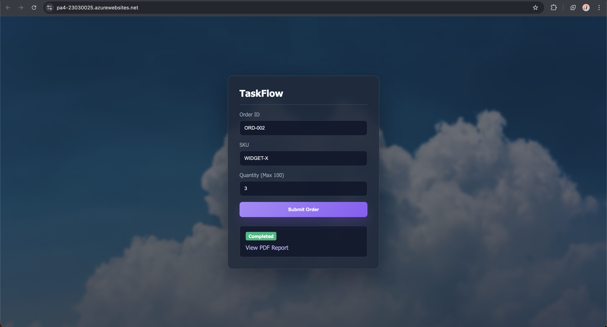

Description: An order with a valid SKU and qty 2 was submitted through the web form. The status panel first showed Running with the live instance ID, then updated to Completed with the report URL link. Clicking the link downloaded the generated PDF, confirming the full pipeline ran end to end.

### Evidence 7.3: Backend Participation

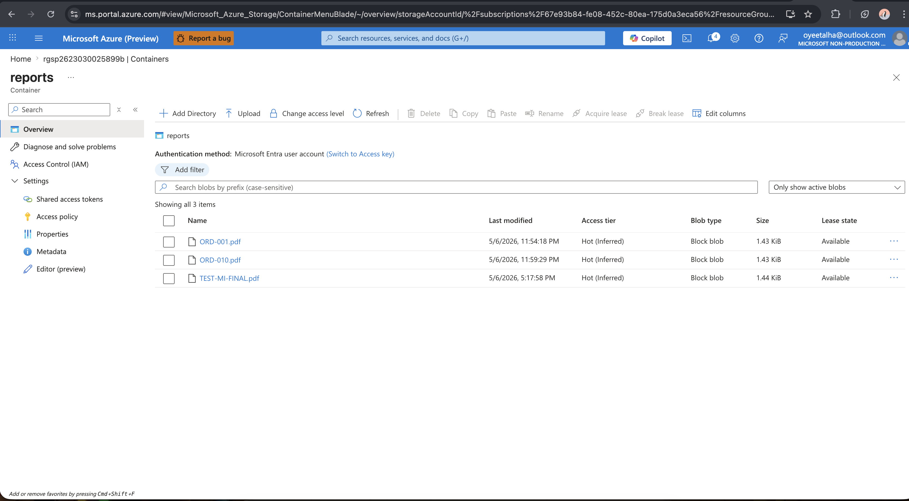

Description: The Function App Monitor shows the orchestration run with both validate_activity and report_activity completing successfully under the same instance ID. The AKS pod logs show an inbound POST /validate request at the same timestamp, and the blob container shows the matching PDF file, tracing the same order ID across all three backend services.

### Evidence 7.4: Reject Path UI

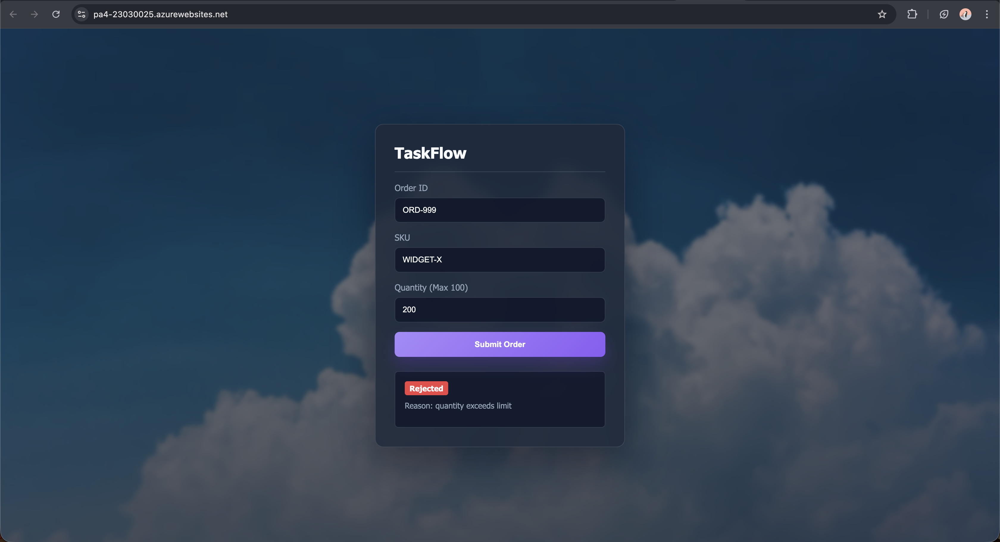

Description: An order with qty 200 was submitted, which exceeds the validator's limit of 100. The UI displayed the rejection message and reason returned by the orchestrator. The Function App Monitor shows the orchestration completed with status: rejected as its output, and az container list confirms no new ACI was created for this order because the orchestrator short-circuited before calling report_activity.

---

## Task 8: Write-up and Architecture Diagram (5 points)

### Evidence 8.1: Architecture Diagram

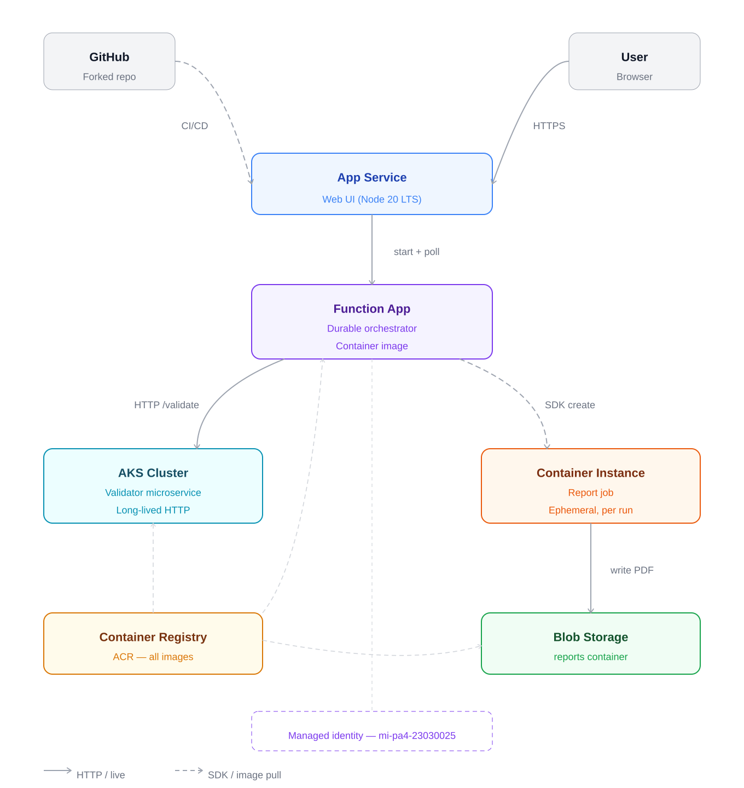

Description: The diagram shows all components: GitHub feeding into App Service via CI/CD, the user hitting the web UI over HTTPS, the App Service calling the Function App to start and poll orchestrations, the Function App calling the AKS validator over HTTP and spawning ACI containers via the SDK, the ACI writing PDFs to Blob Storage, and ACR supplying images to all three container runtimes. The managed identity relationship between the Function App and the resource group is also shown.

### Question 8.2: Service Selection

**App Service** is the right choice for the web frontend because it is a long-running process that needs to stay alive between user requests and serve HTTP at a stable public URL. It also supports CI/CD from GitHub out of the box through the Deployment Center, which means every push to main automatically redeploys the app without any manual steps. A serverless option like Azure Functions would work for the API surface but would not give us the persistent Express server and CI/CD integration in the same clean package.

**Durable Functions** fits the orchestration role because the pipeline has multiple sequential steps where each one depends on the result of the previous one, and the whole thing can take up to a minute or more to complete. Durable Functions checkpoints state between activity calls, so if the report step fails and the runtime replays the orchestrator, the validation step does not re-execute. A regular HTTP-triggered function cannot do this because it has no built-in state persistence across calls and would time out waiting for a 60-second report job to finish.

**Azure Kubernetes Service** is used for the validator because it is a long-lived HTTP microservice that needs to be reachable at a stable endpoint for every single order. AKS gives us full Kubernetes primitives including a LoadBalancer service with a persistent external IP, declarative deployment configuration, and fine-grained control over pod scheduling. The validator must be ready instantly when called, so a scale-to-zero solution would add cold start latency that would hurt every order.

**Azure Container Instances** is the right tool for the report job because the job starts, does its work, and exits. There is no need for a persistent endpoint, no idle time between orders (from the report job's perspective), and no reason to pay for an always-on compute resource. ACI bills only while the container is alive, so a report that takes 20 seconds costs almost nothing per run. Keeping this on AKS as another long-running pod would waste a slot on the node for a container that is idle 99% of the time.

### Question 8.3: ACI vs AKS

When AKS is idle, the node (Standard_B2s) keeps running and billing at its hourly compute rate even if no requests come in. The validator pod sits in Running state, consuming memory and CPU allocation on that node. There is no automatic scale-down to zero with the basic single-node setup used here, so "idle" for AKS just means the CPU utilization is near zero but the bill keeps accumulating.

For ACI in this pipeline, the concept of idle does not really apply in the same way. Each ACI container is created fresh when an order needs a report, runs for the duration of the job, and then gets deleted by report_activity. There is no ACI sitting around between orders. The only cost incurred is the few seconds or minutes the container is alive per run.

If a malicious user spammed the submit button 1000 times in a minute, the ACI side would be the most expensive because the orchestrator would attempt to spawn up to 1000 separate container groups in parallel. Each ACI instance has a per-second billing model, and 1000 simultaneous containers even at 1 vCPU each would generate significant charges very quickly. The AKS validator would also see 1000 POST /validate requests, but since it is already running on a fixed-cost node, the incremental cost from those extra requests is essentially zero.

### Question 8.4: Durable Functions vs Plain HTTP

The most immediate problem with two plain HTTP functions calling each other is timeouts. The report step can take up to a minute, and the default timeout for a consumption-plan HTTP function is around 5 minutes (and even less on some tiers). If the report job is slow or the ACI takes time to start, a plain HTTP function waiting synchronously for it would hit the timeout limit, return an error, and leave no way to know whether the work actually finished or not.

The second problem is state persistence and retry. With Durable Functions, if the report_activity fails partway through, the Durable runtime can replay the orchestrator from the last checkpoint, skipping the already-completed validation step and retrying only the report step. With two plain HTTP functions calling each other, there is no checkpoint. If the second function call fails, the caller has no record of what already ran, so it either retries the entire pipeline from scratch (calling the validator again unnecessarily) or just gives up and loses the order. The Durable Functions model solves both of these problems cleanly without any custom retry or state management code.

### Question 8.5: Cost Review

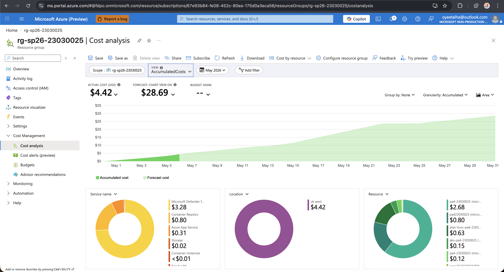

Description: The Cost Analysis view scoped to rg-sp26-23030025 shows the breakdown of spending over the assignment period. The AKS cluster (specifically the Standard_B2s node in the managed node resource group) is the single most expensive resource because it runs continuously whether or not there are any active orders. The App Service B1 plan and the Function App sharing it come second, followed by minimal charges from ACR storage and a few ACI runs. Blob Storage and networking costs are negligible at this scale.

### Question 8.6: Challenges Faced

**ACR image pull failing in AKS with a 401 error.** When I first applied the Kubernetes manifests, the validator pod was stuck in ImagePullBackOff. I ran kubectl describe pod on the failing pod and saw a 401 Unauthorized error from the ACR endpoint. The issue was that I had not created the acr-secret Kubernetes secret before applying the deployment, so the pod had no credentials to pull from the private registry. Once I ran the kubectl create secret docker-registry command with the ACR admin credentials and re-applied the deployment, the pod came up fine. The lesson was to always create the pull secret before applying workloads, not after.

**Function App not picking up updated app settings after adding VALIDATE_URL.** After I set the VALIDATE_URL setting through the CLI and polled the orchestration status, it was still failing with the same "cannot reach validator" error. I checked the Function App logs and noticed it was still using a cached version of the environment. The fix was to restart the Function App after setting the new application settings, since Azure sometimes does not hot-reload settings for containerized function apps the same way it does for code-based ones. After the restart, the orchestration reached validate_activity successfully and the pipeline moved forward.

---